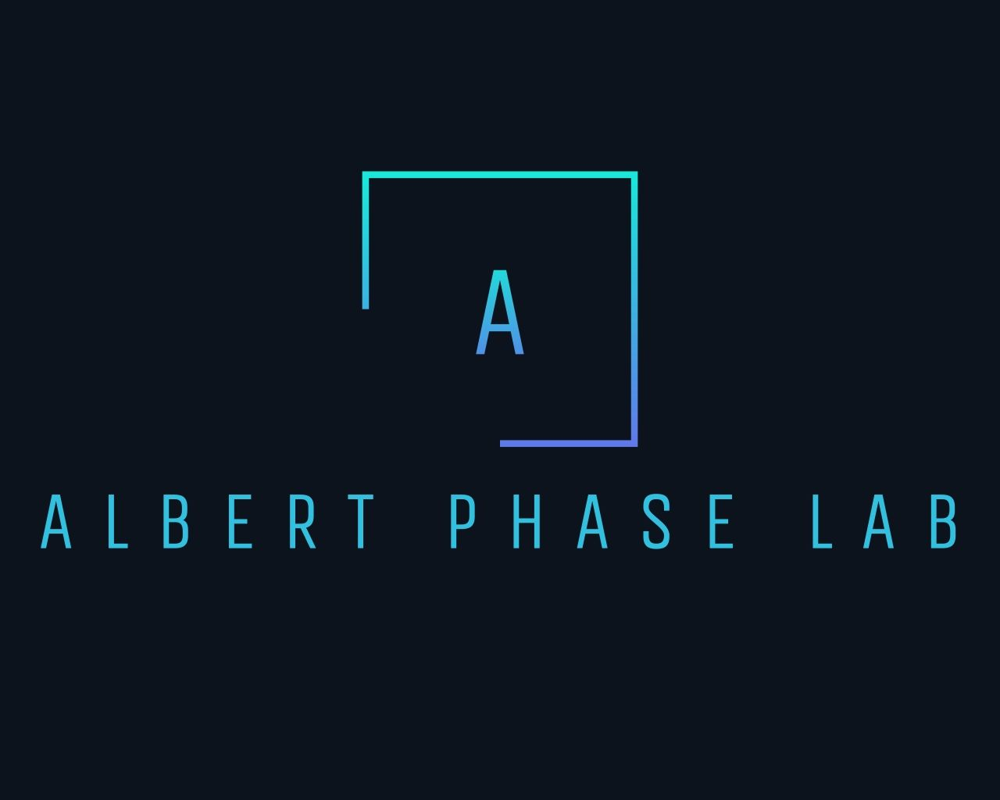
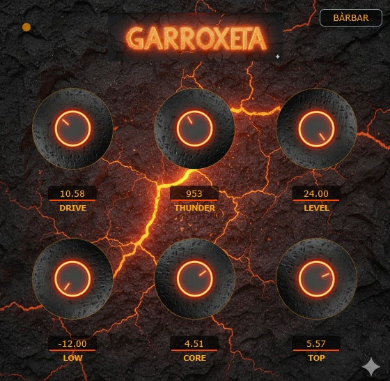
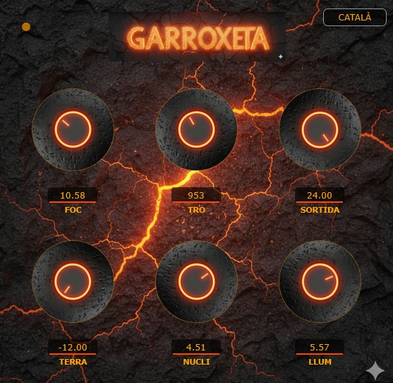

  

# 🔥 Garrotxeta Distortion

> [!IMPORTANT]
> **TRIAL VERSION / VERSIÓ DE MOSTRA**
> This repository contains the trial version of the **Garrotxa** plugin. 
> Aquest repositori conté la versió de mostra del plugin **Garrotxa**.

**Garrotxeta** is a professional high-gain preamp plugin inspired by the raw volcanic power of the Garrotxa region. Developed by **AlbertPhaseLab**, it delivers modern, aggressive saturation with a unique bilingual interface and native oversampling for crystal-clear distortion.

**Garrotxeta** és un plugin de distorsió d'alt guany (Preamp) professional inspirat en la força volcànica de la Garrotxa. Desenvolupat per **AlbertPhaseLab**, ofereix una saturació moderna i agressiva amb una interfície bilingüe única i sobremostreig natiu.

---

## 🌋 Plugin View / Vista del Plugin

| Bàrbar Mode (English) | Mode Terra (Català) |
| :---: | :---: |
|  |  |

---

## 🚀 Features / Característiques

### English (Bàrbar Mode)
* **"Foc" Saturation:** `tanh` based soft-clipping for tube-like response.
* **Native 2x Oversampling:** High-fidelity processing to eliminate aliasing.
* **Sweepable EQ:** 3-band post-EQ with a "Tro" (Thunder) mid-frequency sweep (200Hz - 5kHz).
* **RMS Reactive LED:** Visual feedback of your signal intensity.
* **Bilingual Toggle:** Switch instantly between **English** and **Català**.

### Català (Mode Terra)
* **Saturació "Foc":** Clipping suau basat en `tanh` per una resposta valvular.
* **Oversampling 2x Natiu:** Processament d'alta fidelitat per eliminar l'aliasing.
* **EQ de 3 bandes:** Amb control "Tro" per escombrar freqüències mitjanes (200Hz - 5kHz).
* **LED Reactiu:** Feedback visual basat en el nivell RMS.
* **Selector Bilingüe:** Canvi instantani entre **Anglès** i **Català**.

---

## 🛠️ Installation / Instal·lació

### English
1. **Clone the repository:** Download the source code to your PC.
2. **Assets check:** Ensure the `assets/` folder contains all required images.
3. **Build:** Open `CMakeLists.txt` and build using your preferred IDE (Visual Studio, Xcode, CLion).
4. **Important (Projucer):** If using Projucer, you must include `<JuceHeader.h>` in your source files manually.

### Català
1. **Clona el repositori:** Descarrega el codi font al teu PC.
2. **Verificació d'actius:** Assegura't que la carpeta `assets/` conté totes les imatges necessàries.
3. **Compilació:** Obre el `CMakeLists.txt` i compila utilitzant el teu IDE preferit (Visual Studio, Xcode, CLion).
4. **Important (Projucer):** Si utilitzes Projucer, has d'incloure manualment `#include <JuceHeader.h>` als teus fitxers de font.

---

## ⚖️ License / Llicència

### English
This project is released under the **MIT License**. However, please note that this repository specifically hosts the **trial version** of the full **Garrotxa** plugin.

### Català
Aquest projecte es publica sota la **Llicència MIT**. No obstant això, tingueu en compte que aquest repositori allotja específicament la **versió de mostra** del plugin complet **Garrotxa**.

---
*Developed by AlbertPhaseLab - 2026*